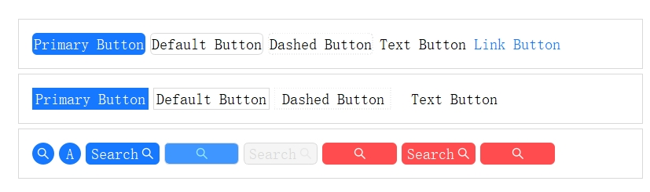
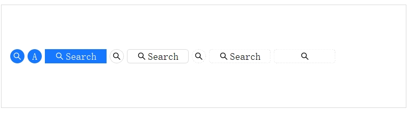
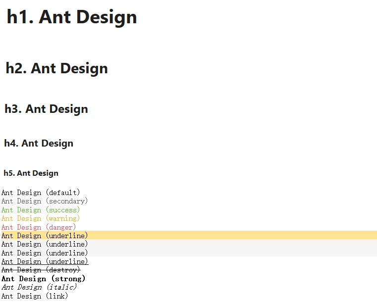
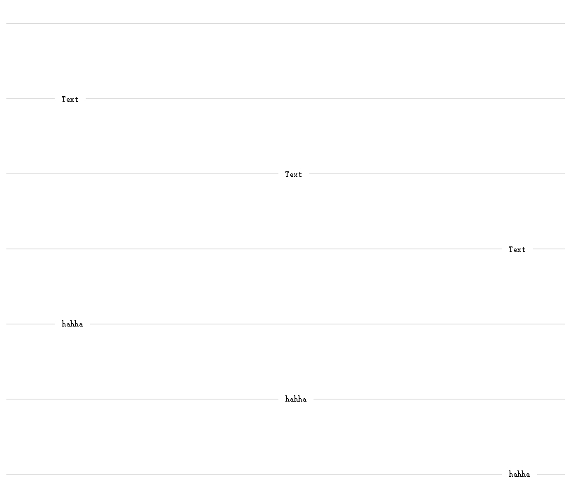
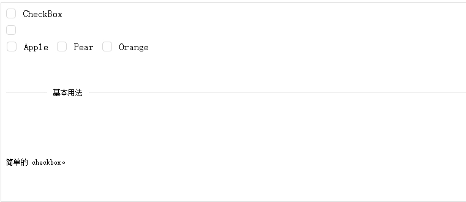

### AntDesignQt5

基于Qt5&& c++17&& [AntDesign](https://ant.design/index-cn)设计风格实现的UI组件库

下载[Windows Demo](https://antdesignqt5.wealook.com/disk-files/release/antdesignqt5-demo-alpha-20240816.zip)体验

### 目的

* 更好的样式风格
* 更简单的调用方式

## 项目计划

* 1.实现数据展示类组件的基础样式及功能
* 2.实现数据录入类组件的基础样式及功能

## 参与开发

本项目使用cmake模块化构建,各个模块说明如下：

| 模块                   | 说明                  |  
|:---------------------|:--------------------|  
| modules/AntDesignQt5 | 对外发布的模块，支持编译静态库/动态库 |   
| modules/CommonUtils  | 工具类库，包含日志及一些工具类     |    
| apps/demo            | demo展示工具            | 

AntDesignQt5模块内ThemeConfig.h头文件包含了antDesignUI的所有样式配置，各个组件内引用该头文件实现样式配置，组件内部尽量不要写死样式，通过配置的方式使用；

各个组件继承AWidget.h，内部定义了 std::unordered_map<std::string, std::unordered_map<std::string, std::string>> styles
成员变量来保存Qss的key和value，最后拼接成字符串，最后调用setStyleSheet设置QSS。

其余按照antDesignUI的组件功能新建.h .cpp文件实现即可。

## 运行此项目

此项目基于cmake构建，需要额外依赖qt5运行

1.安装好QT5

2.设置好Qt5_DIR 的环境变量

3.或在项目根目录CMakeLists.txt 设置 set(Qt5_DIR "your path /lib/cmake/Qt5")

```shell
mkdir build && cd build
cmake ..
```

## 组件实现情况

### 通用

* [Button按钮](./docs/Button.md)

  
  

*
* FloatButton悬浮按钮
* [Icon图标]()
* [Typography排版]()

  

### 布局

* [Divider分割线]()

  

* Flex弹性布局
* [Grid栅格]()
* [Layout布局]()
* [Space间距]()

### 导航

* Anchor锚点 [不实现]
* Breadcrumb面包屑
* Dropdown下拉菜单
* [Menu导航菜单]()
* Pagination分页
* Steps步骤条

### 数据录入

* AutoComplete自动完成
* Cascader级联选择
* Checkbox多选框

 
 

* ColorPicker颜色选择器
* DatePicker日期选择框
* Form表单
* [Input输入框]()
* InputNumber数字输入框
* Mentions提及
* Radio单选框
* Rate评分
* [Select选择器]()
* Slider滑动输入条
* Switch开关
* TimePicker时间选择框
* Transfer穿梭框
* TreeSelect树选择
* Upload上传

### 数据展示

* Avatar头像
* Badge徽标数
* Calendar日历
* [Card卡片]()
* Carousel走马灯
* Collapse折叠面板
* Descriptions描述列表
* Empty空状态
* Image图片
* List列表
* Popover气泡卡片
* QRCode二维码
* Segmented分段控制器
* Statistic统计数值
* Table表格
* Tabs标签页
* Tag标签
* Timeline时间轴
* Tooltip文字提示
* Tour漫游式引导
* Tree树形控件

### 反馈

* Alert警告提示
* Drawer抽屉
* Message全局提示
* Modal对话框
* Notification通知提醒框
* Popconfirm气泡确认框
* Progress进度条
* Result结果
* Skeleton骨架屏
* Spin加载中
* Watermark水印

### 其他

* Affix固钉
* App包裹组件
* ConfigProvider全局化配置
* Util工具类